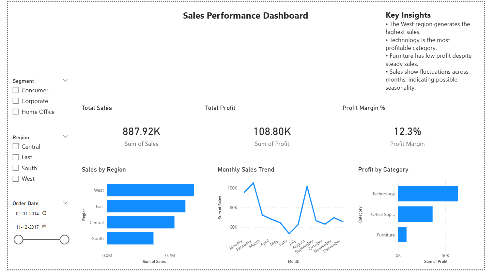

# Sales & Profitability Analysis Dashboard Sales Analysis Power BI Dashboard 
Note: This project was previously named "Sales Analysis Power BI Dashboard" in earlier versions.

##  Overview

This project presents an interactive **Sales Performance Dashboard** built using Power BI.
It provides insights into sales trends, product performance, and regional analysis to support data-driven decision-making.

---

## Tools & Technologies

* **Power BI** – Data visualization and dashboard creation
* **Excel / CSV** – Data source
* **DAX (Data Analysis Expressions)** – Calculations and measures

---

## Key Insights

* Identified **top-performing products** and categories
* Analyzed **monthly and yearly sales trends**
* Compared **regional performance and revenue distribution**
* Evaluated **customer segments and sales contribution**

---

## Dashboard Preview

### 🔹 Overall Dashboard




---

## Project Structure

```
sales-analysis-powerbi-dashboard/
│── Sales_Performance_Dashboard.pbix   
│── screenshots/                      
│── README.md                      
```

---

## 🚀 How to Use

1. Download the `.pbix` file from this repository
2. Open it using **Power BI Desktop**
3. Interact with filters and visuals to explore insights

---

## 💡 Features

* Interactive filters (region, category, date)
* Dynamic visuals and KPIs
* User-friendly dashboard layout

---

## 🎯 Objective

The goal of this project is to demonstrate the ability to:

* Analyze business data
* Create meaningful visualizations
* Derive actionable insights using Power BI

---

## 📬 Contact

If you have any questions or suggestions, feel free to connect.

---
